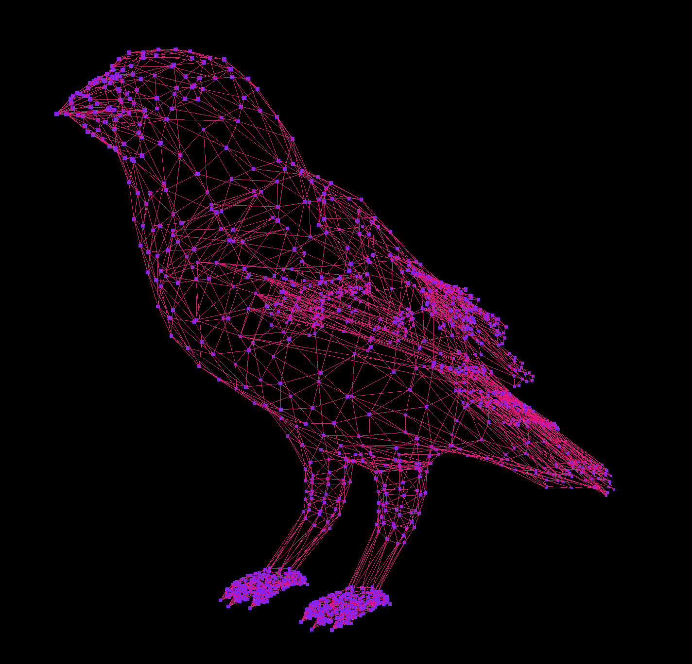

# 3D Kusama Canary Component

A React component to render an interactive 3D Kusama Canary.

## Todo

Web:

- [x] Experiment with the 3D obj file rendering in three.js with shaders
- [ ] Refactor and move three.js experiments to this repos
- [ ] Make it a React component
- [ ] Check with Alan/Lauro what kind of data we get from Kusama
- [ ] Make 3D Canary nodes interactive
- [ ] Randomly distribute interactive nodes
  - Maybe only in the head
- [ ] Implement something like the effect from https://threejs.org/examples/#webgl_video_kinect (Lauro's suggestion)

3D model:

- [ ] Clean up mesh vertices on feet
- [ ] Add more vertices to legs